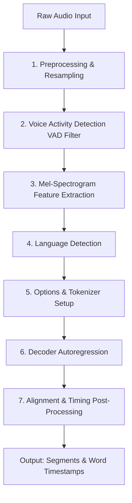
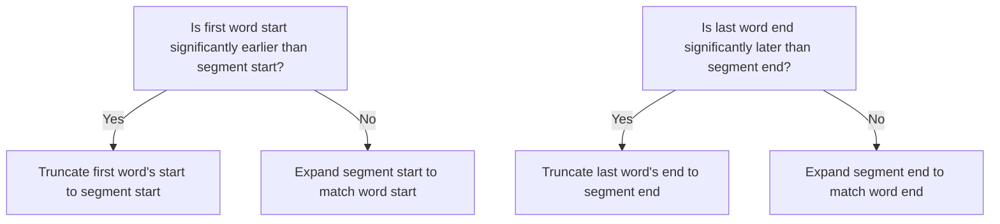

# Deep Dive: The Word-Level Timeline & Probability Generation Pipeline

This documentation provides an architectural and mathematical breakdown of the transcription process, focusing specifically on how **word-level tokens (Words) are generated**, how **start/end timestamps are calculated**, and how **confidence probabilities are derived**. 

While the reference implementation resides in `faster-whisper`, the underlying principles, data representations, and heuristics described here are **programming language-agnostic** and apply generally to any Whisper-based sequence-to-sequence automatic speech recognition (ASR) architecture utilizing cross-attention alignment.

---

## 1. High-Level Transcription Lifecycle

The transcription pipeline maps raw audio waveforms to text segments accompanied by precise metadata. The process executes in seven distinct phases:



### Stage Summary
1. **Audio Preprocessing**: Decodes audio into a single-channel floating-point array and calculates total duration.
2. **VAD Filtering (Optional)**: Segments speech and silences, filtering out silent non-speech frames to optimize decoder attention.
3. **Feature Extraction**: Generates 80-channel (or 128-channel) Mel-spectrogram log-power representations from the audio waveform.
4. **Language Detection**: Feeds early encoder frames to the decoder to determine the language log-likelihood if not explicitly specified.
5. **Tokenizer & Options Setup**: Configures task-specific (transcribe vs. translate) tokens and decoding constraints (e.g., beam size, temperatures).
6. **Decoder Autoregression**: Emits text sub-word tokens representing the transcription of each segment.
7. **Post-Processing & Alignment**: Computes alignment, reconstructs absolute timestamps, applies timing heuristics, and scales results.

---

## 2. Word-Level Timeline Generation (Alignment Phase)

When fine-grained word timings are requested, the pipeline performs **cross-attention alignment**. This technique maps individual text tokens to specific temporal frames in the audio encoder output.

### The Alignment Matrix
The encoder produces sequence frames corresponding to discrete time steps (typically one frame per 20 milliseconds of audio). The decoder generates text tokens.
By extracting the decoder's cross-attention weights, we construct a 2D matrix where cell $(i, j)$ represents the attention weight of the $i$-th text token on the $j$-th encoder frame.

```
                  Encoder Audio Frames (Time ->)
                [ F0 ]  [ F1 ]  [ F2 ]  [ F3 ]  [ F4 ] ... [ Fn ]
   Tokens:
   [ Token_0 ]   0.05    0.80    0.15    0.00    0.00        0.00   <-- Aligned to F1
   [ Token_1 ]   0.00    0.10    0.75    0.15    0.00        0.00   <-- Aligned to F2
   [ Token_2 ]   0.00    0.00    0.05    0.90    0.05        0.00   <-- Aligned to F3
```

### Step 1: Smoothing and Filtering
Raw cross-attention weights are often noisy. To prevent rapid oscillations and false transitions:
* **Median Filtering**: A 1D median filter of a configured window width (e.g., 7 frames) is applied along the time dimension for each token's attention weights. This acts as a low-pass filter to smooth attention peaks.
* **Maximum Attention Mapping**: For each text token, the system identifies the encoder frame index $j$ that maximizes the smoothed attention weight. This yields a list of 1-to-1 mappings: `(text_token_index, encoder_frame_index)`.

---

## 3. Lexical Segmentation & Boundary Calculation

Because speech recognition models operate on **sub-word tokens** (such as Byte-Pair Encodings or WordPieces), multiple consecutive tokens often constitute a single physical word.

### Step 2: Token-to-Word Grouping
The sequence of predicted sub-word tokens is grouped into semantic words using language-specific rules (such as spaces in Western languages or character/morpheme boundaries in East Asian languages).

```
Tokens:      [ "_He" ]   [ "llo" ]   [ " _world" ]
Indices:         0           1             2
Grouping:    \___________________/   \___________/
Word:              "Hello"              "world"
Word Boundaries:  Start: Index 0        Start: Index 2
                  End:   Index 2        End:   Index 3
```

Mathematically, we represent the boundaries as an array of start-indices for each word. If the word sizes (in tokens) are $L_1, L_2, \dots, L_w$, the cumulative boundaries index list $B$ is:
$$B = \left[ 0, L_1, L_1 + L_2, \dots, \sum_{r=1}^{w} L_r \right]$$

### Step 3: Transition Time Mapping ("Jumps")
To extract timestamps, the pipeline determines when the decoder transitions from one token to the next.

1. **State-Change Detection (Jumps)**:
   Let $T$ be the array of aligned token indices. We construct a boolean mask $J$ that identifies transitions where the token index changes:
   $$J_m = \begin{cases} \text{True} & \text{if } m = 0 \text{ or } T_m \neq T_{m-1} \\ \text{False} & \text{otherwise} \end{cases}$$

2. **Frame-to-Time Conversion**:
   The frame indices corresponding to these jumps are extracted and divided by the temporal resolution constant of the model ($\text{tokens\_per\_second}$):
   $$\text{jump\_time}_k = \frac{\text{encoder\_frame\_index}_{J_k}}{\text{resolution\_constant}}$$

3. **Applying Boundaries**:
   Using the cumulative word boundaries $B$, we map each word $i$ (where $i \in [0, w-1]$) to its start and end times:
   $$\text{Start}_i = \text{jump\_time}_{B[i]}$$
   $$\text{End}_i = \text{jump\_time}_{B[i+1]}$$

> [!NOTE]
> By mapping boundaries directly onto token transition times (jumps), the algorithm ensures that the end of one word perfectly matches the start of the next, preventing overlapping timelines.

---

## 4. Word Probability Calculation

Every generated token is accompanied by a softmax probability score reflecting the decoder's prediction confidence. To represent this at the word level:

The probability of a word $W_i$ consisting of sub-word tokens from index $u = B[i]$ to $v = B[i+1] - 1$ is calculated as the **arithmetic mean** of the constituent tokens' probabilities:

$$\text{Probability}(W_i) = \frac{1}{v - u + 1} \sum_{m=u}^{v} P_m$$

Where $P_m$ is the probability score of token $m$.

> [!TIP]
> **Why Arithmetic Mean?**
> Standard sequence generation models estimate whole-word likelihood via joint probability (the product of sub-word probabilities). However, for a confidence score metric, joint probability penalizes longer words unfairly. The arithmetic mean normalized over the token count provides an unbiased, highly-interpretable confidence metric between $0.0$ and $1.0$.

---

## 5. Timing Post-Processing & Heuristics

Raw aligned timestamps are highly accurate but can exhibit edge-case anomalies due to model hallucinations, background noise, or long silences. A series of post-processing heuristics resolves these anomalies:

### 1. Absolute Timeline Translation
Timestamps computed during alignment are relative to the start of the current audio chunk. They must be translated to the absolute timeline of the entire audio source:
$$\text{Absolute Time} = \text{Relative Time} + \text{Segment Offset}$$
Where $\text{Segment Offset}$ is determined by the decoder's current audio frame coordinate (commonly referred to as the `seek` offset).

### 2. Median-Based Duration Capping
To prevent a single word from stretching indefinitely over silent pauses:
1. Compute the duration of all non-zero duration words in the segment.
2. Find the median word duration: $D_{\text{median}}$.
3. Clamp the median at a maximum threshold (typically $0.7$ seconds) to avoid over-inflation in slow speech.
4. Establish a maximum word duration threshold:
   $$D_{\text{max}} = 2 \times D_{\text{median}}$$
5. Any word exceeding $D_{\text{max}}$ is flagged for potential truncation.

### 3. Sentence End Boundary Checking
If a word's duration exceeds $D_{\text{max}}$ and coincides with a sentence punctuation mark:
* If the word itself is a terminal punctuation mark (e.g., `.`, `?`, `!`), its end time is truncated:
  $$\text{End} = \text{Start} + D_{\text{max}}$$
* If the preceding word was a terminal punctuation mark, the current word's start time is shifted forward:
  $$\text{Start} = \text{End} - D_{\text{max}}$$

### 4. Speech Gap & Pause Adjustments
When speech resumes after a long silence, the first word after the pause can sometimes capture pre-speech noise and appear abnormally long. 

```
                                 [--- SILENT PAUSE ---]
Timeline:     ===================|                     |===================
Actual Speech: ... prior word.                         | Hello world ...
Raw Alignment: ... prior word.                         |___________________
First Word (Raw Start):                                ^ [Hello (Starts early during silence)]
First Word (Heuristic Adjusted):                       ^ Adjusted to: End - D_max
```

If the duration of the gap since the last speech segment is large (e.g., $> 4 \times D_{\text{median}}$) and the first word (or first two words) exceeds the maximum allowed duration:
* The first word's end boundary is realigned with the start of the subsequent word.
* The first word's start time is pulled forward to a reasonable boundary:
  $$\text{Start} = \max\left(0, \text{End} - D_{\text{max}}\right)$$

### 5. Segment Boundary Reconciliation
Finally, word-level timings are synchronized with segment-level timings to guarantee hierarchical consistency (i.e., words must sit within their parent segment boundaries):



* **Start Reconciliation**:
  If $\text{Segment Start} < \text{Word}_0[\text{End}]$ and the word starts much earlier than the segment start (e.g., $\text{Segment Start} - 0.5 > \text{Word}_0[\text{Start}]$):
  $$\text{Word}_0[\text{Start}] = \max\left(0, \min\left(\text{Word}_0[\text{End}] - D_{\text{median}}, \text{Segment Start}\right)\right)$$
  Otherwise, adjust the segment boundary:
  $$\text{Segment Start} = \text{Word}_0[\text{Start}]$$

* **End Reconciliation**:
  If $\text{Segment End} > \text{Word}_{-1}[\text{Start}]$ and the word ends much later than the segment end (e.g., $\text{Segment End} + 0.5 < \text{Word}_{-1}[\text{End}]$):
  $$\text{Word}_{-1}[\text{End}] = \max\left(\text{Word}_{-1}[\text{Start}] + D_{\text{median}}, \text{Segment End}\right)$$
  Otherwise, adjust the segment boundary:
  $$\text{Segment End} = \text{Word}_{-1}[\text{End}]$$

---

## 6. Abstract Data Structures (Pseudo-Code Representation)

The following schema represents how word metrics map to objects in a language-agnostic data representation model:

### Unified Word Model Schema
```typescript
interface Word {
  /** The clean textual representation of the word (excluding leading/trailing spacing characters) */
  word: string;
  
  /** Absolute start time of the word in seconds relative to the audio start */
  start: number;
  
  /** Absolute end time of the word in seconds relative to the audio start */
  end: number;
  
  /** Confidence probability score, bounded [0.0, 1.0] */
  probability: number;
}

interface Segment {
  id: number;
  text: string;
  start: number;
  end: number;
  words: Word[] | null;
}
```

This model ensures consumers have full timeline transparency, allowing downstream tasks such as interactive audio-text synchronization, caption generation, and alignment analyses.
